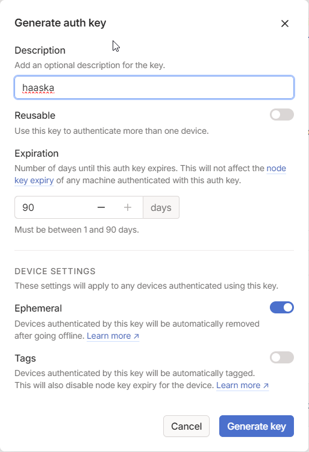

# Haaska with Tailscale

[Haaska](https://github.com/mike-grant/haaska/) shipped in a docker image with [Tailscale](https://tailscale.com/)

It allows to use Alexa Smart Home Skill without exposing your Home Assistant instance to the internet (except <a href="user-content-account-linking">during setup</a> )

If you fork this repo and setup **AWS_ACCESS_KEY_ID** and **AWS_SECRET_ACCESS_KEY** as Github encrypted secrets, a Github workflow will build and publish a docker image to your AWS ECR own account on eu-west-1 that you then can use for your "HomeAssistant-SmartHome" Lambda function

Currently it uses a fork of haaska in order to use environnment variables instead of the config.json for the home assistant url and token

**Requirement**: The [HA Tailscale Add-on](https://github.com/hassio-addons/addon-tailscale) installed and configured

## Big thanks to
- https://github.com/mike-grant
- https://github.com/tieum
- https://github.com/MelleD 

## Setup
### Step 1: Publish the docker image to AWS ECR
1. Go to Settings -> Secrets and variables -> Actions and setup **AWS_ACCESS_KEY_ID** and **AWS_SECRET_ACCESS_KEY** as Github encrypted secrets.
2. Select Actions.
3. Select "ci" on the left.
4. Click "Run workflow".
5. After successful run, the "ha-lambda-tailscale" repository should appear in the AWS ECR including the published image "latest.

### Step 2: Follow the haaska wiki until you reach "Setting up AWS Lambda - Part 1"
https://github.com/mike-grant/haaska/wiki/Setting-up-haaska

### Step 3: Create AWS Lambda function
1. Login to AWS and click on the Services button at the top left. Look for the "Compute" section, and click on "Lambda".
3. Click "Create function" in the upper right.
4. Select the "Container image" tile.
5. Enter a function name, e.g. haaska.
6. Click "Browse images"
7. Select the AWS ECR repository "ha-lambda-tailscale"
8. Under "Images" select the image with tag "latest". This image was published previously by the github workflow for you.
9. Click "Change default execution role" and select "Use existing role".
10. Select the former created "lambda_basic_execution" role.
11. Click "Create function" in the bottom right.
12. The "Function designer" window should open.

### Step 4: Set up the AWS Lambda function
1. In the Function designer view click "Add trigger".
2. Select "Alexa" as source.
3. Select the "Alexa Smart Home" tile.
4. Paste the "Skill ID" from the Alexa Developer Console window (e.g. amzn1.ask.skill.xxxxxxx).
5. Click Add in the bottom right.
6. The "Alexa" trigger should now show up and the "Configuration" tab should be selected.
7. Click "Environment variables" on the left.
8. Click on "Edit and then on "Add environment variable" three times to add the following variables that the lambda function needs:
   
   | ENV                       | Type     | Description                                           |
   | ------------------------- | -------- | ----------------------------------------------------- |
   | HA_TOKEN                  | string   | The long living HA token                              |
   | HA_URL                    | string   | **Important the TAILSCALE ip from HA** e.g http://{tailscale-ha-ip}:8123. Should be start with 100.xxx.xxx.xxx |
   | TAILSCALE_AUTHKEY        	| string   | The ephemeral key set up in tailscale web ui. Should be start with tskey-auth-xxxxx (see https://tailscale.com/kb/1113/aws-lambda/) |

   **HINT: How to create the TAILSCALE_AUTHKEY:** Go to tailscale web ui -> Settings -> Keys - Click "Generate auth key..."
   
   
   

   I advise to limit the concurrency of the Lambda function (e.g. "5") in order not to reach the Tailscale machine limit depending on your plan

### Step 5: Continue with the haaska wiki at "Linking AWS Lambda to Alexa Skills Kit"
https://github.com/mike-grant/haaska/wiki/Setting-up-haaska#linking-aws-lambda-to-alexa-skills-kit

### Step 6: Testing. Follow the haaska wiki "Testing Haaska"
https://github.com/mike-grant/haaska/wiki/Testing-haaska
